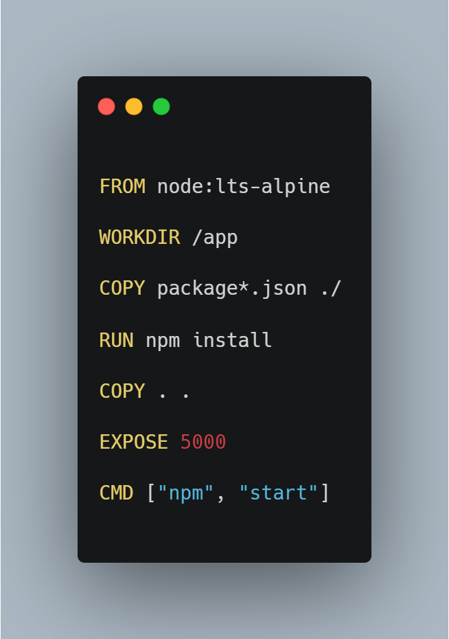
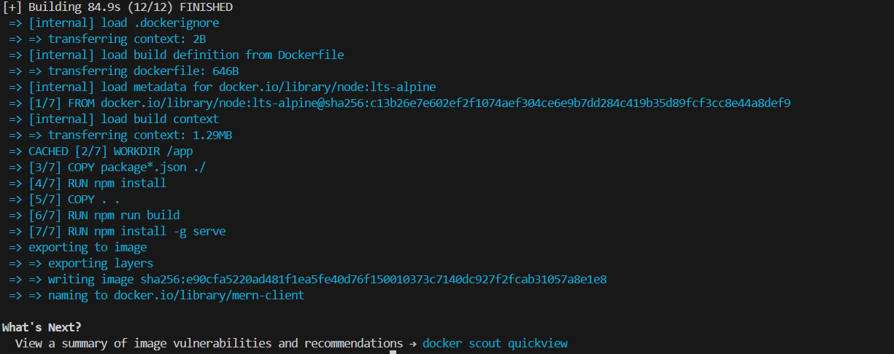
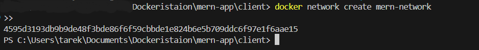
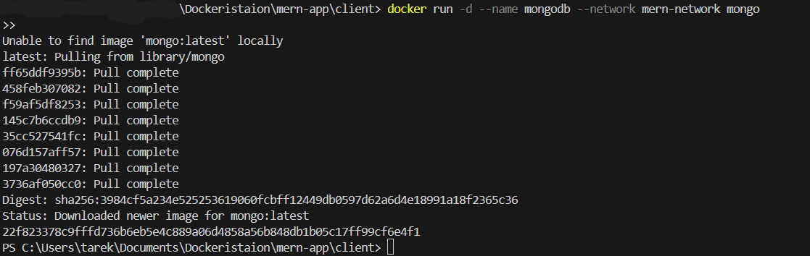
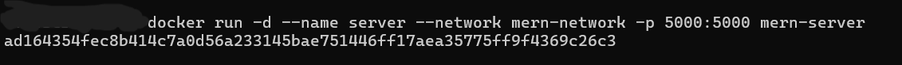
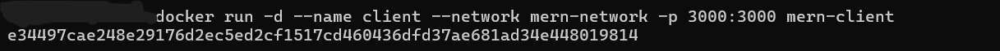
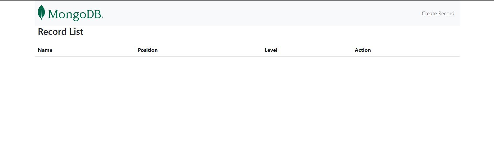

# TP2 : Docker et Docker Compose - Application MERN

## Étapes

### 1. Cloner le Projet

Clonez le dépôt GitLab du projet avec la commande suivante :

```bash
git clone https://gitlab.com/devops_tps/mern-app
```


### 2. Créer les Dockerfiles

#### a. Dockerfile pour le serveur (Express)



Construisez l’image du serveur avec la commande :

```
 cd server
docker build -t mern-server .

```


#### b. Dockerfile pour le client (React)


```
# Utilise une image de base légère Node.js
FROM node:lts-alpine

# Définit le répertoire de travail dans le conteneur
WORKDIR /app

# Copie les fichiers package*.json pour installer les dépendances
COPY package*.json ./

# Installe les dépendances
RUN npm install

# Copie les autres fichiers du client
COPY . .

# Construit l'application React
RUN npm run build

# Installe un serveur HTTP léger pour servir les fichiers de build
RUN npm install -g serve

# Expose le port 3000
EXPOSE 3000

# Démarre le serveur HTTP pour servir l'application
CMD ["serve", "-s", "build"]

```

Construisez l’image du client avec la commande :

```
cd client
docker build -t mern-client .
```




## 3 -Créer un réseau Docker

Créez un réseau Docker pour permettre la communication entre les conteneurs de l'application :

`docker network create mern-network`




### 4. Exécuter MongoDB dans un conteneur

Lancez un conteneur MongoDB en utilisant le réseau que vous venez de créer :

`docker run -d --name mongodb --network mern-network mongo`




### 5. Exécuter les conteneurs du serveur et du client

**a. Exécuter le conteneur du serveur (API Express)** :

`docker run -d --name server --network mern-network -p 5000:5000 mern-server`



**b. Exécuter le conteneur du client (Application React)** :

`docker run -d --name client --network mern-network -p 3000:3000 mern-client`




6. Créer un fichier Docker Compose

   ```

   version: '3'
   services:
     mongodb:
       image: mongo
       container_name: mongodb
       networks:
         - mern-network

     server:
       build: ./server
       container_name: server
       ports:
         - "5000:5000"
       networks:
         - mern-network
       depends_on:
         - mongodb
       environment:
         MONGO_URI: mongodb://mongodb:27017/mern_database

     client:
       build: ./client
       container_name: client
       ports:
         - "3000:3000"
       networks:
         - mern-network
       depends_on:
         - server

   networks:
     mern-network:
       driver: bridge

   ```
   `docker-compose up --build`


   ## Final App :

   
