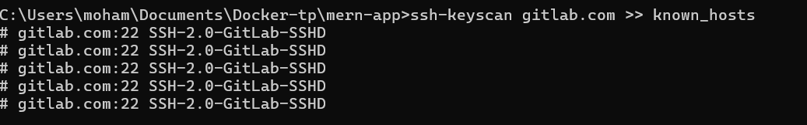

# TP3 : Intégration Continue avec Jenkins sous Windows

Ce fichier explique les étapes pour configurer Jenkins et exécuter un pipeline CI/CD sous Windows en utilisant Docker Desktop.


## **2. Lancer Jenkins avec Docker**
Ouvrez **PowerShell** et exécutez la commande suivante pour démarrer Jenkins :
```powershell
docker run -d -p 8080:8080 -p 50000:50000 --name jenkins `
--privileged `
-v jenkins_home:/var/jenkins_home `
salahgo/jenkins:dind
```
- **Description** :  
  - `-p 8080:8080` : Expose le port pour accéder à Jenkins.
  - `--privileged` : Permet à Jenkins d'utiliser Docker à l'intérieur du conteneur.
  - `-v jenkins_home:/var/jenkins_home` : Monte un volume pour sauvegarder les données de Jenkins.


---

## **3. Vérification de l'accès SSH**
Ajoutez l'hôte GitLab/GitHub aux fichiers connus et testez la connexion SSH.  

### Avec **Git Bash** ou **WSL** :
```bash
ssh-keyscan gitlab.com >> ~/.ssh/known_hosts
```

Testez la connexion :
```bash
ssh -T git@gitlab.com
ssh -T git@github.com
```



---

## **4. Commandes Docker dans Jenkinsfile**
Les étapes principales du pipeline incluent la construction et le scan des images Docker. Par exemple :

### **Scanner une image Docker avec Trivy**
```bash
docker run --rm -v //var/run/docker.sock:/var/run/docker.sock aquasec/trivy:latest image --exit-code 0 --severity LOW,MEDIUM,HIGH,CRITICAL ${IMAGE_NAME_SERVER}
```

- **Description** :  
  - `--rm` : Supprime automatiquement le conteneur après l'exécution.
  - `-v //var/run/docker.sock:/var/run/docker.sock` : Monte le socket Docker.


---

## **5. Nettoyage des ressources Docker**
Pour éviter d'encombrer votre machine avec des artefacts inutiles, utilisez :
```powershell
docker system prune -af
```

- **Description** :  
  - Supprime tous les conteneurs arrêtés, les volumes inutilisés et les images non utilisées.


---

## **6. Programmation Cron dans Jenkins**
Configurez le déclencheur du pipeline pour qu'il s'exécute automatiquement toutes les 5 minutes. Ajoutez l'expression suivante dans la section **Build Triggers** de Jenkins :
```text
H/5 * * * *
```

- **Description** :  
  - Cette expression configure une vérification périodique des changements toutes les 5 minutes.


---

## **Conclusion**
Vous pouvez maintenant configurer Jenkins sous Windows pour automatiser vos pipelines CI/CD. N'oubliez pas d'ajouter vos identifiants Docker Hub et GitLab/GitHub dans Jenkins pour une intégration complète.

---
